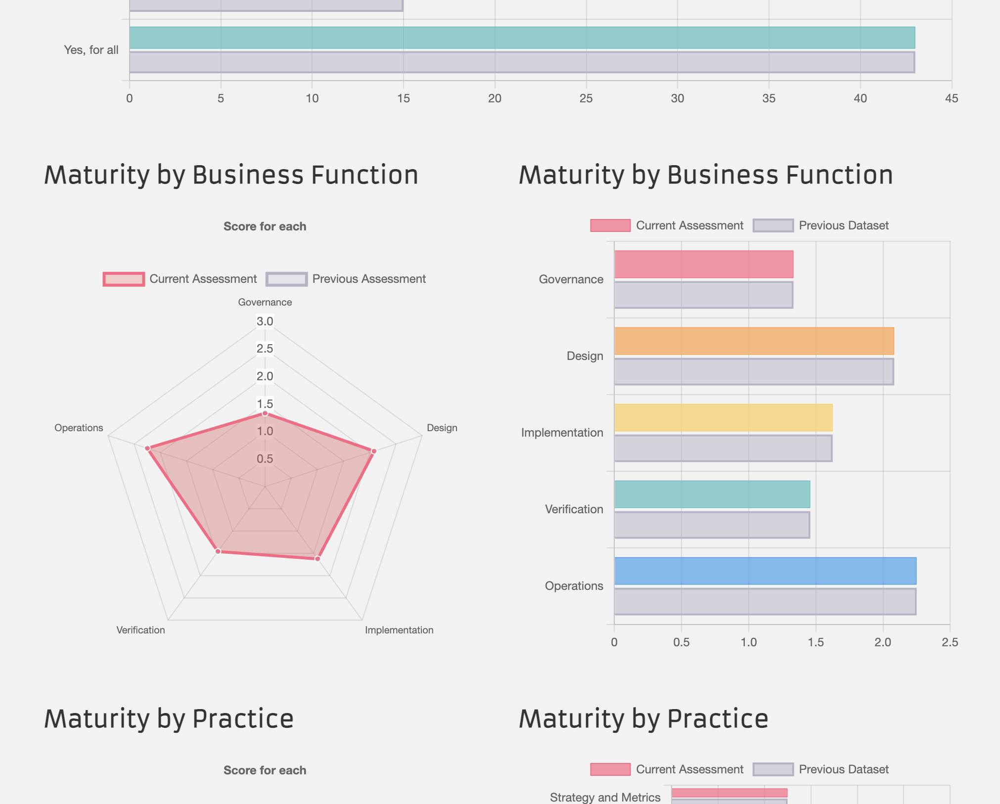

# Account Hub

Constructs endpoints for a sophisticated account database system within the OWASP SAMM framework. File structure:

```
├── source/
│   ├── configuration/
│   ├── controller/
│   ├── middleware/
│   ├── model/
│   ├── route/
│   └── entry-point.js
├── ...
└── README.md
```

## Prerequisites

See `engines` in [package.json](./terminal/package.json):

```json
"engines": {
    "node": ">= 16.0.0",
    "npm": ">= 8.0.0"
},
```

Also, be sure to have Docker `>= 4` installed. If you were to use your local database, MySQL [8.0.32 macOS-arm64](https://dev.mysql.com/downloads/file/?id=516827) is valid to use for MacBook with M1 Chip.

## Get Started

Use the following commands to help you to run or develop this project locally:

```bash
git clone https://github.com/SiegeSailor/OpenSource.AccountHub.git
```

Go to the folder you just created with `git clone`. It should be typically named `OpenSource.AccountHub`:

```bash
cd OpenSource.AccountHub
```

Install all the packages you need. Remember that you have to run this under `node >= 16.0.0` and `npm >= 8.0.0`. You can simply use `nvm use 16` if you have multiple versions on your local machine:

```bash
npm install
```

After installing packages, run the following command to start the project:

```bash
npm run start
```

### Environment

Create a `.env` file in the root folder:

```bash
DATABASE_HOST= # database
DATABASE_USER=
DATABASE_PASSWORD=
DATABASE_CONNECTION_LIMIT=
DATABASE_SKIP_TZINFO= # 1 | 0
DATABASE_PORT=
SESSION_HOST= # session
SESSION_PORT=
SECRET= #
HTTPS= # 1 | 0
SERVICE_PORT=
ORIGIN=
```

## Security

Analysis results, diagrams, and reports are stored within [Document](./document/). Security documentation and analysis should be manually performed before each release, and the corresponding issues should be listed on [Issues](https://github.com/SiegeSailor/OpenSource.AccountHub/issues):

### Security Requirement

Follow [OWASP SAMM 2.0](https://owasp.org/www-project-samm/). The goal is to achieve maturity level 1 in general using [SAMMwise](https://github.com/owaspsamm/sammwise), which is a officially recommended tool by OWASP:

```bash
docker pull stephenmorgan/owasp-sammwise
docker run --port 3000:3000 stephenmorgan/owasp-sammwise
```

Load the JSON result file and view the charts:



### Attack Surface

Follow [OWASP Attack Surface Analysis Cheat Sheet](https://cheatsheetseries.owasp.org/cheatsheets/Attack_Surface_Analysis_Cheat_Sheet.html) to understand and manage application security risks as designing and changing the application, as well as by application security specialists doing a security risk assessment. The focus is on protecting an application from external attack. [OWASP ZAP](https://www.zaproxy.org/) is used:


Run the service first then perform automated scan through HTTP:

```bash
docker-compose up --build
```

### Threat Modeling

Follow [OWASP Threat Modeling](https://owasp.org/www-community/Threat_Modeling). The tool remains unselected.
